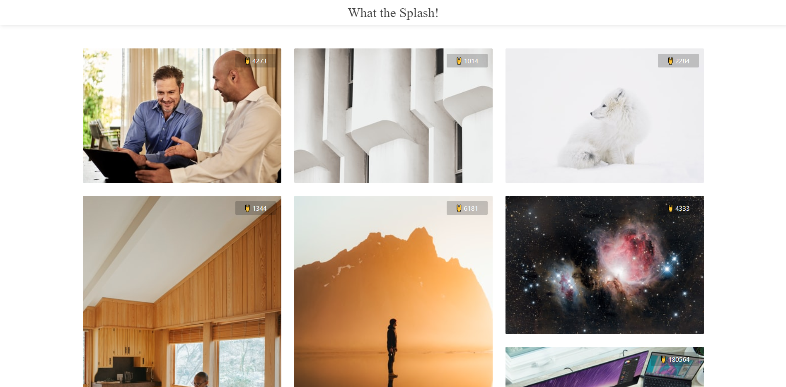
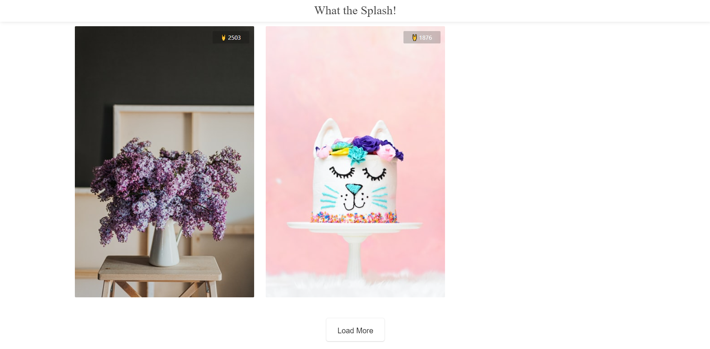

# Getting Started with Create React App

This project was bootstrapped with [Create React App](https://github.com/facebook/create-react-app).

# What the Splash !

A project made to learn and apply different concepts in Redux-saga. Being new to Redux-saga here is to the link tutorial I followed

## Snapshots




### Sample Deployment : https://jaykaku.github.io/What-the-Splash/

### Setup

1. Clone this repository or download zip.
2. Navigate to project folder in terminal and type
   ```bash
   npm install
   ```
3. Navigate to project folder in terminal and type
   ```bash
   npm start
   ```
4. The setup is ready to use.

## Developer

### Jay Kaku - [LinkedIn](https://www.linkedin.com/in/jay-kaku-a33382191/)
